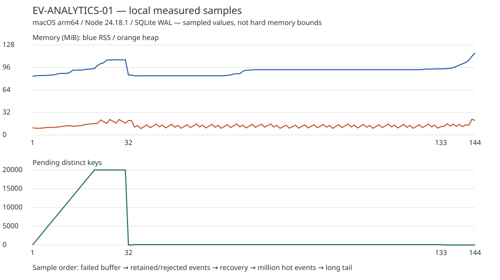

# EV-ANALYTICS-01 统计关停、批写与缓冲实验

2026-09-25；[PR #119](https://github.com/dnslin/ariso-next/pull/119)；[Issue #82](https://github.com/dnslin/ariso-next/issues/82)。依据 [analytics §3–5](../../../specs/SPEC-analytics.md#3-唯一计数入口)及[任务卡](../../gates.md#ev-analytics-01-统计关停批写与缓冲实验)。本实验提供 AN-03/04/05 的技术证据，不代表生产 ANALYTICS-COUNT、报表或日期保留业务已经实现。

## 本轮评审优化（开发阶段）

2026-09-25 按所有者最新要求修复 P2/P3，只执行本地验证。删除本 PR 新增的 `Analytics experiment` 自动工作流，恢复[开发阶段检查约定](../../execution.md#适用检查)；生产发布流程未修改。下文双架构数据是旧提交的真实历史证据，不能算作本轮修改后的 Docker 验证。

- P2：用实际 SIGTERM/SIGINT 到达时 resolve 的 Promise 放行首块，替代 500ms 定时放行。信号处理器只记录与放行，Next 仍负责停止连接、等待在途请求及退出；最终 SQLite 刷库仍同步执行。
- 回归：运行器故意等待 700ms 再发送信号。相同测试在旧实现的 `signal < first-byte` 断言处失败，修复后 SIGTERM/SIGINT 均通过；完整响应、三表计数及关闭顺序断言没有削弱。实测 SIGTERM/SIGINT 分别在请求开始后 727/726ms 到达，首块分别再晚 4/1ms，计数零损失。见[本轮六场景 trace](./review-regression.json)。
- P3：每个场景开始时集中定义 `fullBuffer`、`recordCount`、`pendingEvents`、`dropped`，删除重复场景判断，不引入场景框架。
- 独立代码复审通过，无新增阻断问题。

本轮使用 Node 24.18.1 / pnpm 11.19.0，实际命令与结果：

```sh
pnpm install --frozen-lockfile
pnpm exec vitest run --project unit tests/unit/analytics/collector.test.ts --project integration tests/integration/analytics/lifecycle.test.ts
pnpm run lint
pnpm run typecheck
pnpm run format:check
node docs/tasks/check.mjs
node docs/tasks/check.mjs --self-test
git diff --check
```

定向测试 6/6 通过（5 项聚合单测 + 1 项覆盖六场景的真实 standalone 集成测试），其中集成测试重新执行独立 Next 构建。冻结安装、lint、类型、格式、文档检查及其 5 项拒绝用例自测均通过；diff 检查无空白错误。本轮未运行 Docker/双架构、浏览器或全套生产测试；实验外产品代码没有变化，先前全套结果保留在下文，不冒充本轮复跑。

## 前置与范围

`gh issue view 82 --json number,title,body,comments,state,url` 回读无评论。原生 `issues/82/dependencies/blocked_by` 为已完成的 #68，`blocking` 为 #83；已阅读 [EV-DELIVERY-01](../EV-DELIVERY-01/README.md) 的真实 HTTP、开始计数及双架构证据。

从 `origin/main` 的 `9ecff7d` 建立 `codex/issue-82-analytics-experiment`。主目录正在被 #76 使用，实验独立位于 `/Volumes/data/project/ariso-issue-82`，没有混入主目录修改。

实现只包含实验 collector、SQLite 临时三表、独立 Next standalone 应用和测试。日期与已获准的访问事件为受控输入，沿用 delivery 的责任边界；未新增生产路由、迁移或统计模块。无产品界面/Figma 修改，主题、响应式、触控及安全区域不适用；浏览器回归仅验证已有应用。

## 结论和下游接入约束

- `record` 只改内存。1000 个不同键触发下一轮事件循环写入；每批最多 1000 个键，成功事务和内存扣除间没有 `await`。三表任一句失败整批回滚，原增量保留，重试不重复。
- 定时器 5 秒、批次 1000 键、容量 20000 键仍是工程起始值。失败后 30 秒才自动重试；满缓冲仍接受已有键的增量，拒绝新键并累计漏计。成功恢复不清除已发生漏计标记。
- 默认 Next 16.3.5 信号处理先停止接收连接并等待在途 HTTP，再关闭 Next、执行 `after` 工作，最后调用框架自己的 `process.exit`。实验仅用同步 `exit` 回调有界刷库和关闭 SQLite，不替换信号处理、不自行调用 `process.exit`、不在 `exit` 中安排异步任务。
- **当前生产入口不是上述方案。** `docker/entrypoint.sh` 设置 `NEXT_MANUAL_SIG_HANDLE=1`，`server-start.ts` 停止 upload/media 后自行退出，没有等待 HTTP drain。规格中“当前由 Next 退出”已落后于现有实现。#83 接入时必须统一现有队列关停、HTTP 停止接收/在途请求及最终刷库顺序；不能只把本实验回调拼到现有流程便声称满足正常退出保证。本 Issue 按修改边界不修改生产协调器。
- 框架等待未结束 HTTP 并没有应用层绝对时限。这里测量的是由夹具主动完成的真实在途传输和有界刷库；部署仍需给正常传输与同步批写足够的停止宽限。超出宽限被 SIGKILL 的进程不属于无损正常关停。
- SIGKILL 不运行退出回调，已提交前缀保留，内存增量丢失。持续写失败退出同样丢失剩余内存增量，错误及数量保留在实验 trace。**20000 是不同键上限，不是丢失访问次数上限**；热点同键能累计任意多事件。5 秒也不是故障积压下的最大丢失时间窗口。

同步退出刷库只适用于已固定的同步 SQLite 驱动。它会暂时阻塞退出，不能推广成异步数据库的退出方案。实验退出码保留 Next 的 SIGTERM=143/SIGINT=130；刷库失败通过 trace 的 `complete:false`、`lastError`、`pendingEvents` 表示，不把框架退出码当写入成功证据。

实现依据：[Next 自托管关停说明](https://nextjs.org/docs/app/guides/self-hosting#graceful-shutdown)、安装版本 `next/dist/server/lib/start-server.js` 的 cleanup 顺序、[Node exit 仅能同步执行](https://nodejs.org/docs/latest-v24.x/api/process.html#event-exit)、[SQLite 事务](https://www.sqlite.org/lang_transaction.html)和 [UPSERT](https://www.sqlite.org/lang_upsert.html)。复用现有 better-sqlite3 13.0.3，无新增依赖。

## 测量与证据

本地 macOS arm64、Apple M4、16 GiB RAM，Node 24.18.1、pnpm 11.19.0、Next 16.3.5、SQLite 3.53.4。文件系统块大小、总量及可用空间均记录于 [压力原始报告](./local-pressure.json)。测试使用真实磁盘 SQLite WAL，`busy_timeout=100ms`；持续写失败通过 SQLite `query_only` 注入，不声称制造物理磁盘故障。

| 场景                      | 本地实测                                                                                           |
| ------------------------- | -------------------------------------------------------------------------------------------------- |
| 单事件定时刷新            | 5025.57ms；刷新前数据库为零，之后三表为 1                                                          |
| 1000 键阈值               | 5.86ms；记录函数返回时没有 SQL 写尝试，随后一批写入                                                |
| 持续写失败与满缓冲        | 20000 键保留；真实等待 30 秒发生第二次失败；再接收 100000 旧键事件、拒绝 100000 新键               |
| 故障恢复                  | 20 批、94.27ms，三表均为 120000；重复 flush 不增加计数，漏计标记保留                               |
| 1000000 次/100 个热点键   | 236.86ms                                                                                           |
| 100000 次/100000 个长尾键 | 420.94ms，100 批                                                                                   |
| 内存采样                  | 144 点，RSS 峰值 122241024 字节，heap 峰值 23669256 字节；是此数据分布下的采样峰值，不是硬字节上限 |



本实验不是十万图片一年报表查询压测，未验证排行/保留任务。事件键长度及分布也会影响实际内存，不将这些耗时作为产品 SLA。

Next 子进程场景包含 SIGTERM/SIGINT 在途传输、已提交前缀后的 SIGKILL、持续写失败、满缓冲失败退出及退出时刷完 20000 键。正常场景在收到信号后才交付首块，断言完整响应、最终三表一致和刷库先于数据库关闭；满缓冲正常退出额外断言进入退出回调前仍有全部 20000 个待写键。

[六场景真实退出 trace](./local-lifecycle.json)记录收到信号、首块、传输完成、刷库开始/结束及数据库关闭的顺序。

| Next 场景     | 退出耗时（ms） | 已接收但丢失 | 数据库三表计数        |
| ------------- | -------------- | ------------ | --------------------- |
| SIGTERM       | 993.10         | 0            | [18, 18, 18]          |
| SIGINT        | 993.50         | 0            | [18, 18, 18]          |
| SIGKILL       | 4.56           | 17           | [1000, 1000, 1000]    |
| write-failure | 5.57           | 17           | [0, 0, 0]             |
| full-buffer   | 8.43           | 20000        | [0, 0, 0]             |
| full-drain    | 87.91          | 0            | [20000, 20000, 20000] |

## 初版实际命令与检查状态

全部命令在独立 worktree 使用 `PATH=/Users/dnslin/.nvm/versions/node/v24.18.1/bin:$PATH`。

```sh
pnpm install --frozen-lockfile
pnpm exec vitest run --project unit tests/unit/analytics/collector.test.ts
node tests/experiments/analytics/pressure.ts /tmp/ariso-pressure.json
pnpm exec vitest run --project integration tests/integration/analytics/lifecycle.test.ts
pnpm run format:check
pnpm run lint
pnpm run typecheck
pnpm run test:unit
pnpm run build
pnpm run test:integration --maxWorkers=4
pnpm exec vitest run --project integration tests/integration/media/tools.test.ts
pnpm run test:integration --maxWorkers=2
pnpm --dir tests/experiments/ui install --frozen-lockfile
EGO_TASK_SPACE=3 EGO_KEEP_SPACE=1 pnpm run test:browser
node docs/tasks/check.mjs
node docs/tasks/check.mjs --self-test
git diff --check
```

已完成：冻结安装、聚合器 5 项定向单测、真实压力脚本、六场景 Next 测试（补录进程内环境后定向复跑通过）、lint、类型检查、397 项单测和生产构建。降低并发后完整集成 457/457（54 文件）通过；新增六场景关停、Ego Lite 浏览器、格式和文档检查均通过。浏览器见[运行摘要](./browser.json)。

首次全套集成 456/457 通过，既有 `media/tools.test.ts` 等待 ExifTool 子进程 ready 超过原有 3 秒限制；当时同机另一任务也在跑完整套件。原断言定向复跑 8/8 通过，随后全套 `--maxWorkers=2` 457/457 通过（199.58 秒）。未修改测试、放宽超时或跳过检查。

初次 Next standalone 启动因继承根 `type:module` 而报 `require is not defined`，在独立应用声明 `type:commonjs` 后原测试通过。初次类型检查指出环境对象类型过窄，改为 Node 的 ProcessEnv 后通过。生产构建仍输出既有 SQLite Debug 二进制追踪诊断，退出码为 0；未隐藏该日志，实际 Release 驱动由集成测试验证。

## 初版审计与远端验证（历史）

使用 `code-review-and-quality` 先读测试、再按正确性/可读性/模块边界/安全/性能检查，并由独立代理复核。已修复超时监控未覆盖等待传输、Docker 构建上下文路径、压力报告上传目录，以及满缓冲退出证据缺少开始状态断言。独立审计最终结论通过，无未解决的本次范围内阻断问题。后续仅补录实际进程内 Node/平台/架构并断言，已重新完成 lint、类型、格式及六场景定向验证。

初轮按当时要求新增 `Analytics experiment` PR 工作流（本轮已删除），只构建临时验证镜像并运行实验，不登录镜像仓库、不推送镜像、不部署。生产发布工作流保持原状。首轮及补录环境后的最终轮次均通过。[最终运行 36137834544](https://github.com/dnslin/ariso-next/actions/runs/36137834544) 验证代码提交 `360bbc9d953f37a791f169f1b0db93b87f218dea`。后续证据归档提交仅含文档/JSON，没有修改运行代码。报告顶层 `node` 是测试运行器版本，实际 Next/容器环境以 trace 的 `initialized` 为准；两个容器均实际运行 Node 24.21.0，PID 1，Linux x64/arm64。

| 平台  | 真实压力                      | standalone                     | Docker 六场景               | SIGTERM 耗时      | 退出时刷完 20000 键     |
| ----- | ----------------------------- | ------------------------------ | --------------------------- | ----------------- | ----------------------- |
| AMD64 | [通过](./amd64/pressure.json) | [通过](./amd64/lifecycle.json) | [通过](./amd64/docker.json) | 1095.44ms，零损失 | 315.37ms，20 批，零损失 |
| ARM64 | [通过](./arm64/pressure.json) | [通过](./arm64/lifecycle.json) | [通过](./arm64/docker.json) | 1076.23ms，零损失 | 302.41ms，20 批，零损失 |

两架构 SIGKILL 均保留已提交 1000 次并丢失未提交 17 次；持续写失败保留错误并在退出丢失待写 17 次/满缓冲 20000 次，额外拒绝新键单独记为 dropped。证据同时保留实际内存曲线采样、硬件/文件系统与每批时延，不能把不同环境耗时相互替代。

初轮远端实际命令由历史工作流保存：冻结安装、5 项聚合器单测、`node tests/experiments/analytics/pressure.ts test-results/analytics/pressure.json`、`node tests/experiments/analytics/run.ts`、以独立 standalone 为上下文的 `docker build`，以及设置 `ANALYTICS_SKIP_BUILD=1 ANALYTICS_IMAGE=analytics-experiment:<arch> ANALYTICS_REPORT=test-results/analytics/docker.json` 再运行 `run.ts`。两项检查均 success。最终 PR 为待评审；未合并、未关闭 Issue、未发布或部署。
